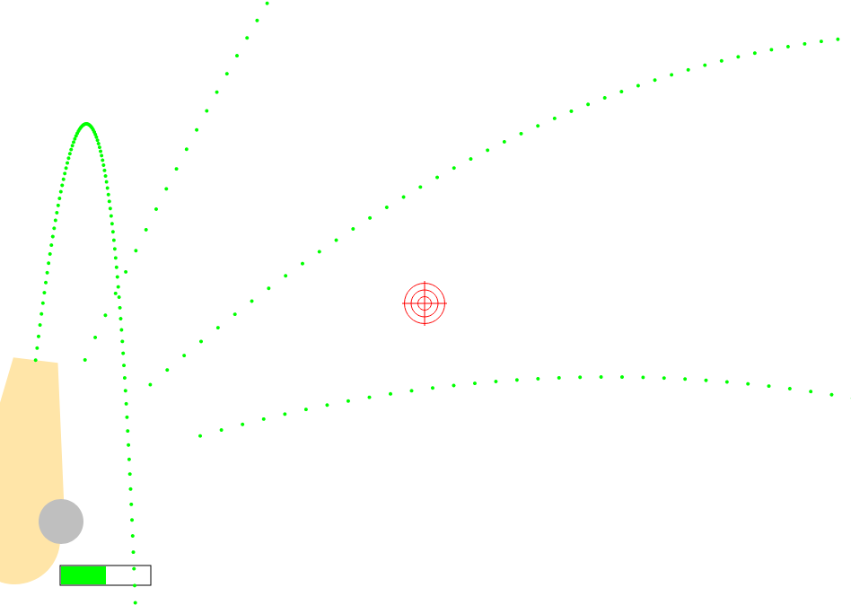

# Aim and fire!

*мой первый завершенный проект*

Все просто, запускаем файл index.html и играем!

## Немного скриншотов:

<p align="center">
    
    
</p>

## cannon.js

Основные параметры, которые можно менять находятся в конструкторе:

```js
3	this.ctx = context;
	// необходим контекст canvas в котором будет отрисовываться пушка
4	this.r = 50;
	// основной размер пушки
	// для того, чтобы была возможность вращать пушку, все координаты и размеры
	// переводятся в радиальные координаты, соответственно и размер пушки
	// задан через радиус
5	this.x = x + 1.5*this.r;
6	this.y = y + 2*this.r;
	// центр вращения пушки (центр колеса)
7	this.angle = 0;
	// угол вращения
8	
9	this.maxStrength = 30;
	// максимальная сила выстрела, чем больше - тем дальше полетит снаряд
10	this.strength    = this.maxStrength / 2;
	// текущаяя сила
11	this.ds          = .5;
	// скорость изменения силы
12
13	this.onAim  = false;
14	this.onFire = false;
```

Ядро пушки, также находится в объекте пушки:
```js
16	this.ammo = {
17		x: x + 5*this.r,	// <-
18		y: y + this.r,		//  |- координаты
19		r: 20,				// радиус
20		dx: 0,				// <-
21		dy: 0,				//  |- скорость изменения координат
22		ddx: -.01,			// <-
23		ddy: .35			//  |- скорость изменения скорости
24	}
```

## TODO:

- добавить счетчик
- добавить дебаг-панель со всякими переключателями
- поработать над физикой
- избавиться от setInterval (ибо тормозит)